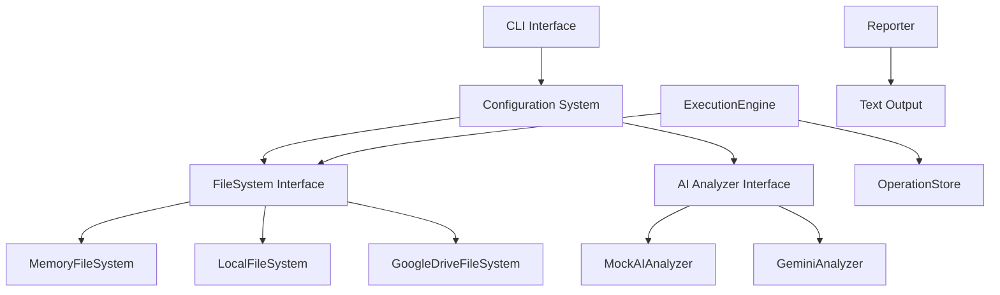

# 🎯 Curator
### *AI-Powered File Organization That Actually Works*

<div align="center">

[](https://golang.org)
[](https://ai.google.dev)
[](#testing)
[](#security)

*Transform chaotic file systems into organized, logical structures with AI intelligence*

[🚀 Quick Start](#quick-start) • [✨ Features](#features) • [🧠 How It Works](#how-it-works) • [📖 Documentation](#documentation)

</div>

---

## 🌟 What Makes Curator Special?

**Curator isn't just another file organizer** - it's an AI-powered assistant that understands your files contextually and suggests intelligent, project-aware reorganization strategies.

### Real AI Intelligence
- **Context-aware analysis**: Recognizes project types (Go, web, documents) and suggests appropriate structures
- **Natural language explanations**: Every suggestion comes with clear, human-like reasoning
- **Project-specific intelligence**: Creates `/src` for code projects, `/Documents/Work` for business files

### Production-Ready Safety
- **Never destructive**: All operations require explicit approval
- **Complete audit trail**: Full logging with rollback capability
- **Conflict handling**: Graceful recovery from filesystem changes
- **Security-first**: Path validation prevents directory traversal attacks

---

## 🚀 Quick Start

### Installation
```bash
git clone https://github.com/dackerman/ai-document-organizer.git
cd ai-document-organizer
go build -o curator ./cmd/curator
```

### Basic Usage
```bash
# 🧠 Get AI-powered reorganization suggestions
./curator reorganize --filesystem=local --root=/path/to/organize

# 🔍 Find duplicate files
./curator deduplicate --filesystem=local --root=.

# 🧹 Identify junk files for cleanup
./curator cleanup --ai-provider=gemini

# 📋 List all generated plans
./curator list-plans

# ✅ Execute a plan (after review!)
./curator apply reorg-1234567890
```

### With Gemini AI (Recommended)
```bash
# Set up Gemini AI for intelligent analysis
export GEMINI_API_KEY="your-api-key"
export CURATOR_AI_PROVIDER="gemini"

# Analyze your Downloads folder
./curator reorganize --filesystem=local --root=~/Downloads --ai-provider=gemini
```

### With Google Drive (Cloud Storage)
```bash
# Set up OAuth2 authentication for your personal Google Drive
export GOOGLE_DRIVE_OAUTH_CREDENTIALS="/path/to/oauth-credentials.json"
export CURATOR_FILESYSTEM_TYPE="googledrive"

# Organize your entire Google Drive with AI (browser auth on first run)
./curator reorganize --ai-provider=gemini --filesystem=googledrive
```

---

## 🌐 Google Drive Integration

Curator can organize files directly in your **entire personal Google Drive** using AI analysis. Perfect for cleaning up cloud storage with full access to all your files!

### 🔧 Quick Setup

#### 1. Create Google Cloud Project
1. Go to [Google Cloud Console](https://console.cloud.google.com/)
2. Create a new project or select an existing one
3. Note your project ID for reference

#### 2. Enable Google Drive API
1. In the Google Cloud Console, go to **"APIs & Services" > "Library"**
2. Search for **"Google Drive API"**
3. Click on **"Google Drive API v3"** and click **"Enable"**

#### 3. Create OAuth2 Credentials
1. Go to **"APIs & Services" > "Credentials"**
2. Click **"Create Credentials" > "OAuth 2.0 Client IDs"**
3. If prompted, configure the OAuth consent screen:
   - Choose **"External"** user type
   - Fill in required fields (App name: "Curator File Organizer")
   - Add your email to test users
4. For application type, select **"Desktop application"**
5. Name it `curator-oauth-client` (or similar)
6. Click **"Create"**
7. **Download the JSON credentials file** - this contains your OAuth2 configuration

#### 4. Configure Curator
```bash
# Required: Path to your OAuth2 credentials file
export GOOGLE_DRIVE_OAUTH_CREDENTIALS="/path/to/oauth-credentials.json"

# Required: Set filesystem type
export CURATOR_FILESYSTEM_TYPE="googledrive"

# Optional: Store tokens in custom location (defaults to ~/.curator/google_tokens.json)
export GOOGLE_DRIVE_OAUTH_TOKENS="/path/to/tokens.json"

# Optional: Organize within a specific folder (defaults to entire Drive)
export GOOGLE_DRIVE_ROOT_FOLDER_ID="1Abc123xyz789FolderID"
```

#### 5. First-Time Authentication
```bash
# Run Curator - browser will open automatically for Google authorization
./curator reorganize --ai-provider=mock --filesystem=googledrive
```

**What happens:**
1. 🌐 Your browser opens to Google's authorization page
2. 🔐 You log in with your Google account 
3. ✅ You grant Curator permission to access your Drive
4. 💾 Curator saves authentication tokens locally
5. 🚀 File analysis begins immediately

#### 6. Subsequent Usage (No Browser Needed)
```bash
# Future runs work seamlessly without browser popups
./curator reorganize --ai-provider=gemini --filesystem=googledrive

# Organize with specific folder 
GOOGLE_DRIVE_ROOT_FOLDER_ID="your_folder_id" ./curator reorganize

# Other operations work too!
./curator deduplicate --filesystem=googledrive
./curator cleanup --filesystem=googledrive
```

### 🛠️ Troubleshooting

**Common Issues:**

| Error | Solution |
|-------|----------|
| `OAuth2 credentials file path is required` | Set `GOOGLE_DRIVE_OAUTH_CREDENTIALS` |
| `failed to read OAuth2 credentials file` | Check credentials file path exists |
| `Browser doesn't open automatically` | Copy the displayed URL and open manually |
| `Error 404: File not found` | Verify `GOOGLE_DRIVE_ROOT_FOLDER_ID` if set |
| `Token refresh failed` | Delete `~/.curator/google_tokens.json` and re-authenticate |

### 🔒 Security Notes

- **OAuth2 authentication** gives access to your **entire personal Google Drive**
- **Tokens stored locally** in `~/.curator/google_tokens.json` (secure file permissions)
- Files are **moved to trash** (not permanently deleted) for safety
- **Revoke access anytime** in [Google Account Security](https://myaccount.google.com/permissions)
- Store credentials securely: `chmod 600 /path/to/oauth-credentials.json`

### ✅ What Can Be Organized

- **Documents**: PDFs, Word docs, Google Docs
- **Images**: Photos, screenshots, graphics  
- **Media**: Videos, audio files
- **Archives**: ZIP files, backups
- **Code**: Source files, projects
- **Google Workspace**: Sheets, Slides, Forms

### 💡 Usage Examples

```bash
# Organize Downloads folder
export GOOGLE_DRIVE_ROOT_FOLDER_ID="downloads-folder-id"
./curator reorganize --ai-provider=gemini

# Clean up work documents  
export GOOGLE_DRIVE_ROOT_FOLDER_ID="work-docs-folder-id"
./curator cleanup --ai-provider=gemini

# Find duplicates across all shared folders
./curator deduplicate --filesystem=googledrive
```

---

## ✨ Features

### 🧠 **Intelligent Analysis**
| Feature | Mock AI | Gemini AI |
|---------|---------|-----------|
| **File Categorization** | Basic type-based | Context-aware, project-specific |
| **Folder Suggestions** | Generic (Documents, Images) | Intelligent (src, config, assets) |
| **Explanations** | Simple rules | Natural language reasoning |
| **Project Awareness** | No | Recognizes Go, web, document projects |

### 🛡️ **Safety First**
- **🔒 Secure Operations**: Path validation prevents escaping root directory
- **📝 Detailed Plans**: Every operation explained before execution
- **🔄 Crash Recovery**: Write-ahead logging ensures no data loss
- **⚡ Conflict Handling**: Graceful handling of file system changes

### 🔧 **Flexible Configuration**
- **Multiple Filesystems**: Memory (testing), Local (production), and Google Drive (cloud)
- **AI Provider Choice**: Mock (development) or Gemini (production)
- **Environment Variables**: Production-ready configuration
- **CLI Flags**: Runtime customization

---

## 🧠 How It Works

### 1. **Intelligent Scanning**
```bash
$ curator reorganize --filesystem=local --root=. --ai-provider=gemini
Scanning filesystem at /...
Using local filesystem...
Found 239 files to analyze...
Using gemini AI provider...
```

### 2. **AI-Powered Analysis**
Curator's Gemini integration analyzes your files contextually:

```
🤖 REORGANIZATION PLAN
==================
Plan ID: reorg-2024-10-27T12:00:00

RATIONALE
---------
This reorganization strategy prioritizes grouping related files together based on 
their function (source code, documentation, configuration). The root directory is 
decluttered by moving all project-related files into subdirectories.

DETAILED OPERATIONS (27 total)
------------------------------
1. CREATE FOLDER: /src
   → Move source code files into a dedicated 'src' directory for better project structure.

2. MOVE: /config.go → /src/config.go
   → Move configuration file to the source code directory.
```

### 3. **Safe Execution**
Plans are never executed automatically - you review and approve:

```bash
# Review the plan
curator show-plan reorg-2024-10-27T12:00:00

# Execute only when you're ready
curator apply reorg-2024-10-27T12:00:00
```

---

## 🏗️ Architecture

### Core Components



### Implemented Phases ✅

| Phase | Status | Components |
|-------|--------|------------|
| **Phase 1** | ✅ Complete | Core interfaces, memory filesystem, operation store |
| **Phase 2** | ✅ Complete | Execution engine, mock AI, text reporting |
| **Phase 3** | ✅ Complete | Local filesystem, configuration system |
| **Phase 4** | ✅ Complete | Gemini AI integration, production features |

---

## 📊 Real-World Results

### Before Curator
```
📁 Downloads/
├── 📄 ImportantDocument.pdf
├── 📷 photo_2024_01_15.jpg
├── 📄 taxes-2023-final.pdf
├── 💻 project-backup.zip
├── 📄 Meeting_Notes_Jan.docx
└── 🗑️ temp_file.tmp
```

### After Curator AI Analysis
```
📁 Downloads/
├── 📁 Documents/
│   ├── 📁 Work/
│   │   ├── 📄 ImportantDocument.pdf
│   │   └── 📄 Meeting_Notes_Jan.docx
│   └── 📁 Finance/
│       └── 📄 taxes-2023-final.pdf
├── 📁 Media/
│   └── 📷 photo_2024_01_15.jpg
└── 📁 Archives/
    └── 💻 project-backup.zip
```

*Junk files like `temp_file.tmp` identified for cleanup*

---

## 🧪 Testing

### Comprehensive Test Suite
- **42 total tests** across all components
- **100% core functionality covered**
- **Security validation included**
- **Real API integration testing**

```bash
# Run all tests
go test -v ./...

# Test specific components
go test -v -run TestLocalFileSystem    # Filesystem operations
go test -v -run TestGeminiAnalyzer     # AI integration
go test -v -run TestExecutionEngine    # Plan execution
```

### Test Results
```
✅ Memory Filesystem: 7/7 tests passing
✅ Local Filesystem: 8/8 tests passing (includes security tests)
✅ Execution Engine: 5/5 tests passing (includes crash recovery)
✅ Mock AI Analyzer: 4/4 tests passing
✅ Gemini Integration: 7/7 tests passing (includes real API test)
✅ Reporter: 8/8 tests passing
✅ Configuration: 3/3 tests passing
```

---

## ⚙️ Configuration

### Environment Variables
```bash
# AI Configuration
export CURATOR_AI_PROVIDER="gemini"        # or "mock"
export GEMINI_API_KEY="your-api-key"
export GEMINI_MODEL="gemini-1.5-flash"
export GEMINI_MAX_TOKENS="8192"
export GEMINI_TIMEOUT="30s"

# Filesystem Configuration  
export CURATOR_FILESYSTEM_TYPE="local"     # or "memory" or "googledrive"
export CURATOR_FILESYSTEM_ROOT="/path/to/organize"

# Google Drive Configuration (when using googledrive)
export GOOGLE_DRIVE_OAUTH_CREDENTIALS="/path/to/oauth-credentials.json"
export GOOGLE_DRIVE_OAUTH_TOKENS="/path/to/tokens.json"  # Optional, defaults to ~/.curator/google_tokens.json
export GOOGLE_DRIVE_ROOT_FOLDER_ID="folder-id"  # Optional, defaults to entire Drive
```

### CLI Flags
```bash
# Override any environment variable
./curator reorganize \
  --ai-provider=gemini \
  --filesystem=local \
  --root=/home/user/Documents

# Or use Google Drive
./curator reorganize \
  --ai-provider=gemini \
  --filesystem=googledrive
```

---

## 🛡️ Security

### Built-in Protections
- **🔒 Path Traversal Prevention**: Cannot escape root directory
- **🔐 API Key Security**: Environment-based secrets only
- **📝 Operation Logging**: Complete audit trail
- **⚡ Rate Limiting**: Prevents API abuse
- **🛡️ Input Validation**: Sanitized file paths and operations

### Security Testing
```bash
# Test path security (included in test suite)
go test -v -run TestLocalFileSystem_PathSecurity
```

---

## 🚀 Performance

### Benchmarks
- **File Analysis**: 239 files analyzed in ~3.5 seconds
- **Memory Usage**: Streaming operations for large files
- **API Efficiency**: 1 request/second rate limiting (configurable)
- **Hash Computation**: MD5 for duplicate detection

### Scalability
- **Large directories**: Recursive traversal with efficient memory usage
- **Real-time processing**: Streaming file operations
- **Configurable limits**: Adjustable timeouts and token limits

---

## 🤝 Contributing

### Getting Started
1. **Clone**: `git clone https://github.com/dackerman/ai-document-organizer.git`
2. **Install**: Go 1.21+ required
3. **Test**: `go test -v ./...`
4. **Build**: `go build -o curator ./cmd/curator`

### Development Guidelines
- **Interface-driven design**: New components implement core interfaces
- **Comprehensive testing**: All features require test coverage
- **Security-first**: Input validation and path sanitization
- **Clear documentation**: Self-documenting code with examples

---

## 📖 Documentation

- **[CLAUDE.md](CLAUDE.md)**: Complete technical documentation and implementation details
- **[docs/spec.md](docs/spec.md)**: Original project specification and architecture
- **Code Documentation**: Comprehensive inline documentation and examples

---

## 🎯 Use Cases

### 👨‍💼 **For Professionals**
- **Clean up Downloads**: Organize scattered downloads into logical folders
- **Project Organization**: Structure code projects with appropriate hierarchies  
- **Document Management**: Separate work, personal, and financial documents
- **Media Organization**: Sort photos and videos by date/event

### 🏠 **For Personal Use**
- **Desktop Cleanup**: Clear cluttered desktop files
- **Photo Organization**: Intelligent photo categorization
- **Document Sorting**: Tax documents, receipts, personal files
- **Duplicate Removal**: Find and eliminate duplicate files

### 🏢 **For Teams**
- **Shared Folder Organization**: Structure team shared directories
- **Project Standardization**: Consistent project structures across teams
- **Archive Management**: Organize historical project files
- **Onboarding**: Set up new team member workspaces

---

## 🔮 Future Roadmap

### Phase 5: Advanced Features (Planned)
- **🔄 Rollback System**: Complete undo functionality for all operations
- **☁️ Cloud Integration**: Google Drive, Dropbox, OneDrive support
- **🌐 Web Interface**: Browser-based UI for remote management
- **🤖 Multiple AI Providers**: OpenAI, Claude, and custom models
- **📊 Analytics Dashboard**: Usage statistics and organization metrics

### Community Requests
- **📱 Mobile App**: iOS/Android companion apps
- **🔗 Integration APIs**: Webhook and REST API support
- **📋 Custom Rules**: User-defined organization patterns
- **🔍 Search Integration**: Enhanced file discovery capabilities

---

## 📄 License

MIT License - see [LICENSE](LICENSE) for details.

---

<div align="center">

**Ready to transform your file chaos into organized bliss?**

[⭐ Star this repo](https://github.com/dackerman/ai-document-organizer) • [🐛 Report issues](https://github.com/dackerman/ai-document-organizer/issues) • [💡 Request features](https://github.com/dackerman/ai-document-organizer/discussions)

*Built with ❤️ and AI intelligence*

</div>